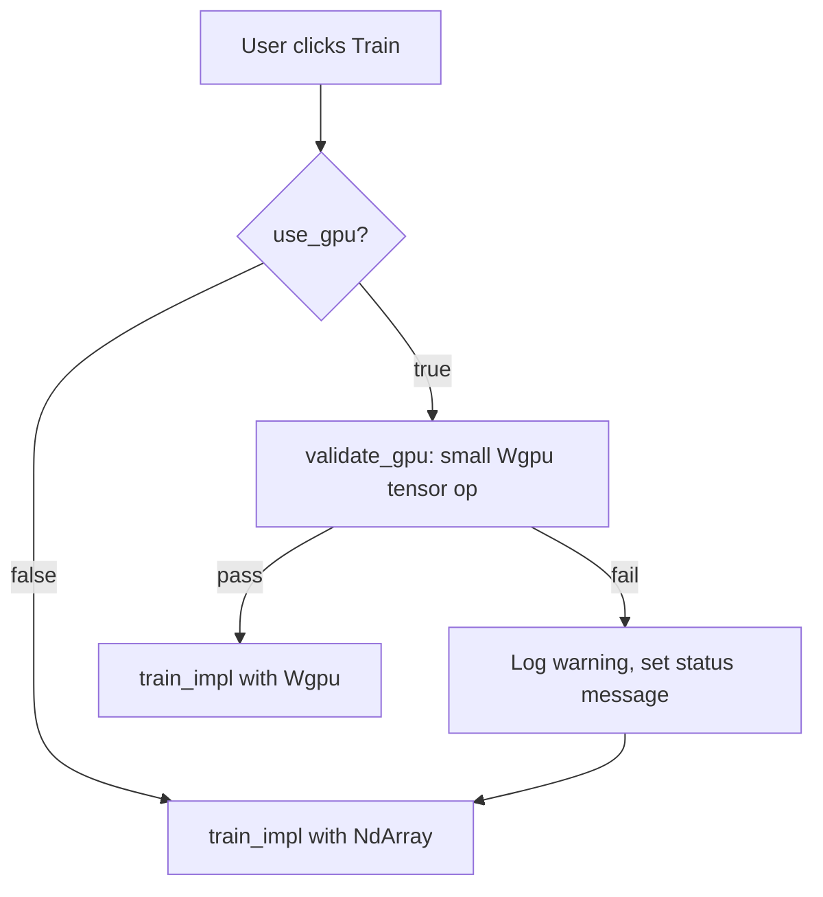

# GPU Pre-Training Validation

## Problem

When a user selects GPU training (`use_gpu = true`), the app blindly calls `Wgpu::Device::default()` and starts training. If the GPU driver is broken, out of VRAM, or the WGPU adapter can't actually execute compute shaders, training crashes or hangs with no user feedback. Detection in `gpu.rs` is purely informational -- it populates stats for the UI but never gates whether GPU training should proceed.

## Approach

Add a `validate_gpu()` function in `gpu.rs` that performs a real tensor computation on the WGPU backend before the training loop begins. If validation fails, automatically fall back to CPU and surface a warning in the UI.




## Changes

### 1. Add `validate_gpu()` to [src/nn/gpu.rs](src/nn/gpu.rs)

Add a new public function that attempts a small WGPU computation:

```rust
pub fn validate_gpu() -> Result<String, String> {
    use burn::tensor::Tensor;
    use burn::backend::Wgpu;
    type B = Wgpu;

    let device = <B as burn::tensor::backend::Backend>::Device::default();

    // Small matrix multiply: proves the backend can allocate + compute
    let a = Tensor::<B, 2>::ones([4, 4], &device);
    let b = Tensor::<B, 2>::ones([4, 4], &device);
    let c = a.matmul(b);
    let vals = c.into_data().to_vec::<f32>()
        .map_err(|e| format!("GPU tensor readback failed: {}", e))?;

    // Sanity check: 4x4 identity * 4x4 ones = all 4.0
    if vals.len() != 16 || vals.iter().any(|&v| (v - 4.0).abs() > 0.01) {
        return Err("GPU computation produced incorrect results".into());
    }

    // Return adapter name for display
    let name = detect_wgpu_adapters()
        .into_iter()
        .next()
        .map(|a| a.name)
        .unwrap_or_else(|| "Unknown GPU".into());

    Ok(name)
}
```

Key properties:

- Uses the exact same `Wgpu` backend and `Device::default()` that training will use
- Tests allocation, compute, and readback -- the three things that can fail
- Completes in milliseconds (4x4 matmul)
- Returns the adapter name on success for UI display

### 2. Wire validation into `train()` in [src/nn/training.rs](src/nn/training.rs)

In the `if use_gpu` branch (line 86), call `validate_gpu()` before creating the device. On failure, log a warning, update `progress.compute_stats` to reflect fallback, and proceed with the CPU path instead:

```rust
if use_gpu {
    match crate::nn::gpu::validate_gpu() {
        Ok(gpu_name) => {
            // ... existing GPU stats population ...
            let device = <Wgpu as Backend>::Device::default();
            train_impl::<GpuBackend>(device, market_data, progress, feature_flags);
        }
        Err(reason) => {
            tracing::warn!("GPU validation failed: {}. Falling back to CPU.", reason);
            if let Ok(mut stats) = progress.compute_stats.lock() {
                stats.backend_name = format!("CPU (fallback: {})", reason);
                stats.using_gpu = false;
                stats.gpu_detected = false;
            }
            let device = <NdArray as Backend>::Device::default();
            train_impl::<CpuBackend>(device, market_data, progress, feature_flags);
        }
    }
} else { /* existing CPU path */ }
```

### 3. Surface fallback in the UI in [src/ui/nn_view.rs](src/ui/nn_view.rs)

The compute stats panel already reads `stats.backend_name` and `stats.using_gpu`. With the fallback message in `backend_name` (e.g. `"CPU (fallback: GPU tensor readback failed)"`), the existing UI will naturally display it. No nn_view changes are strictly required, but we can optionally add an orange warning label when `backend_name` contains "fallback" for extra visibility.

### 4. Add a test in [src/nn/gpu.rs](src/nn/gpu.rs)

Add a `#[test]` that calls `validate_gpu()` and asserts it returns `Ok` or `Err` without panicking. This ensures the validation path doesn't crash even on CI machines without GPUs.

## Out of scope

- Selecting a specific GPU adapter (multi-GPU) -- currently uses WGPU default
- VRAM capacity checks -- the smoke-test will fail naturally if VRAM is exhausted
- Async validation -- the 4x4 matmul is fast enough to run synchronously on the training thread

