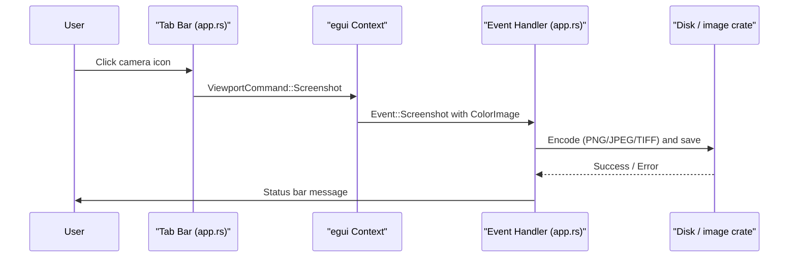

# Screenshot Feature for Active Tab

## Context

The app is an egui/eframe desktop app (`[src/app.rs](src/app.rs)`). The top panel renders tab buttons on the left and a "Refresh Data" / spinner on the right using `Layout::right_to_left`. Settings live in `[src/ui/settings_view.rs](src/ui/settings_view.rs)` with persistence via `[src/data/cache.rs](src/data/cache.rs)` JSON helpers. No image-processing crate exists yet.

## New Dependency

Add the `image` crate to `[Cargo.toml](Cargo.toml)`:

```toml
image = "0.25"
```

This provides PNG/JPEG/TIFF encoding with compression control.

## A) Camera Icon Button in the Tab Bar

**File:** `[src/app.rs](src/app.rs)`

In the `right_to_left` layout section (line ~395), insert a camera button **before** the existing Refresh/spinner logic so it appears to the far right:

```rust
ui.with_layout(egui::Layout::right_to_left(egui::Align::Center), |ui| {
    // Screenshot button (camera icon)
    if ui.button("📷").on_hover_text("Take screenshot").clicked() {
        self.capture_screenshot(ctx);
    }

    ui.separator();

    // existing Refresh / spinner logic ...
});
```

**Capture implementation** -- add a method `capture_screenshot` on `MktNoiseApp`:

```rust
fn capture_screenshot(&self, ctx: &egui::Context) {
    let settings = self.state.screenshot_settings.clone();
    ctx.send_viewport_cmd(egui::ViewportCommand::Screenshot);
    // Store settings snapshot so the callback can use them
}
```

egui's `ViewportCommand::Screenshot` requests a pixel buffer of the current frame. The result arrives on the **next** frame via `ctx.input(|i| i.events)` as `egui::Event::Screenshot`. We handle it in `update()`:

```rust
let events: Vec<egui::Event> = ctx.input(|i| i.events.clone());
for event in &events {
    if let egui::Event::Screenshot { image, .. } = event {
        save_screenshot(image, &self.state.screenshot_settings);
    }
}
```

`**save_screenshot` helper** (new free function or method):

1. Convert the `egui::ColorImage` pixel data to an `image::RgbaImage`.
2. Based on `ScreenshotSettings.file_type`, encode via the `image` crate:
  - **PNG** -- use `image::codecs::png::PngEncoder` with `CompressionType` mapped from the compression setting (None -> Default/Fast, Low -> Default, High -> Best).
  - **JPEG** -- use `image::codecs::jpeg::JpegEncoder::new_with_quality()` (None -> 100, Low -> 80, High -> 50).
  - **TIFF** -- use `image::codecs::tiff::TiffEncoder` (compression not directly supported by the crate for TIFF, so the setting is informational only; note this in a tooltip).
3. Build the file path: `{save_path}/{timestamp}.{ext}` with a `chrono::Local::now()` timestamp.
4. Write to disk and set `state.status_message` on success/failure.

## B) Screenshot Settings

### New Settings Struct

**File:** `[src/data/models.rs](src/data/models.rs)`

```rust
#[derive(Debug, Clone, Serialize, Deserialize, PartialEq)]
pub enum ScreenshotFileType {
    Png,
    Jpeg,
    Tiff,
}

#[derive(Debug, Clone, Serialize, Deserialize, PartialEq)]
pub enum ScreenshotCompression {
    None,
    Low,
    High,
}

#[derive(Debug, Clone, Serialize, Deserialize)]
pub struct ScreenshotSettings {
    pub save_path: String,
    pub file_type: ScreenshotFileType,
    pub compression: ScreenshotCompression,
}

impl Default for ScreenshotSettings {
    fn default() -> Self {
        Self {
            save_path: "./screenshots".to_string(),
            file_type: ScreenshotFileType::Png,
            compression: ScreenshotCompression::None,
        }
    }
}
```

### Wire into AppState

**File:** `[src/app.rs](src/app.rs)`

Add `screenshot_settings: ScreenshotSettings` to `AppState` (line ~121) and initialize it in `Default` by attempting `load_json("screenshot_settings.json")` with a fallback to `ScreenshotSettings::default()`.

### Settings UI

**File:** `[src/ui/settings_view.rs](src/ui/settings_view.rs)`

Add a new section **above** the NN Training section:

```
render_screenshot_section(ui, state, &mut prev_visible);
```

The section renders:

- **Save Path** -- `ui.text_edit_singleline(&mut state.screenshot_settings.save_path)` with a label.
- **File Type** -- three `ui.selectable_value()` radio-style buttons for Png / Jpeg / Tiff.
- **Compression** -- three `ui.selectable_value()` radio-style buttons for None / Low / High.
- **Save Settings** button -- calls `save_json("screenshot_settings.json", &state.screenshot_settings)` and updates `status_message`.

### Persistence

Uses the existing `[src/data/cache.rs](src/data/cache.rs)` `save_json` / `load_json` helpers -- no changes needed there.

## Architecture Flow




## Files Changed Summary


| File                      | Change                                                                                                                                 |
| ------------------------- | -------------------------------------------------------------------------------------------------------------------------------------- |
| `Cargo.toml`              | Add `image = "0.25"`                                                                                                                   |
| `src/data/models.rs`      | Add `ScreenshotFileType`, `ScreenshotCompression`, `ScreenshotSettings`                                                                |
| `src/app.rs`              | Add `screenshot_settings` to `AppState`, camera button in tab bar, screenshot event handling, `capture_screenshot` + `save_screenshot` |
| `src/ui/settings_view.rs` | Add screenshot settings section with save path, file type, compression controls                                                        |


